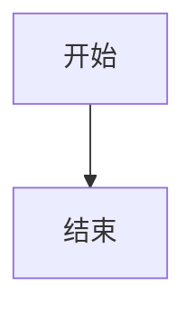
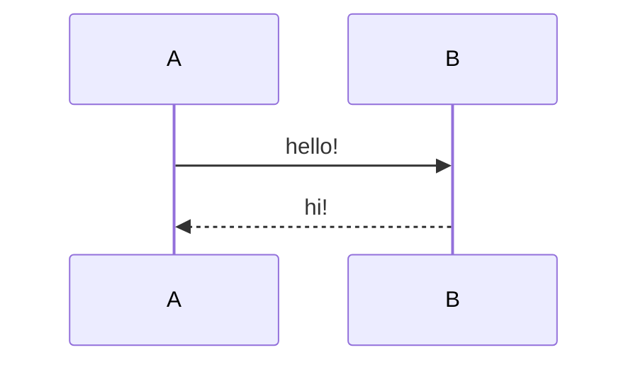
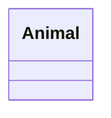

# 常见markdown格式

## 表格


| 语文|数学 |英语 | 哲学 |
| - | - | - | - |
| 100| 100|100 |100 |
| 100| 100| 100| 100|
| 100| 100| 100| 100|

## 图片


## 引用

> 真的很厉害了

## 加粗

**加粗的文字**

## 下划线

<u>下划线</u>
## 上标和下标

~下标~ 文字^上标^

## 无序列表

- 真的厉害
- 真的不错
- 还好啦
- 也还行

## 有序列表
1. 有序列表
2. 有序列表
3. 有序列表
## 任务列表
- [ ] 未完成
- [x] 已经完成
## 行内代码块
`行内代码块`
## 块级代码块

```ts
console.log("Hello world")
```

## 链接
[天空之城网站](https://www.huchenghe.site)

## 思维导图mermaid
### 流程图

### 时序图



### 甘特图
```mermaid
gantt
title 天空之城
dateFormat  2024-12-12
```
### 类图




 

